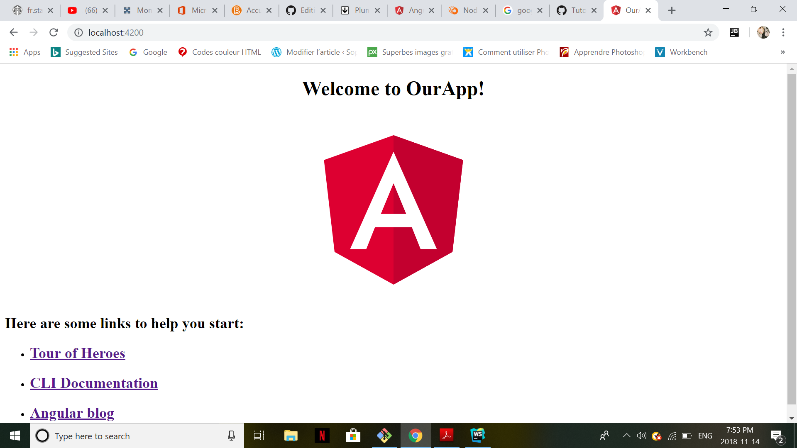
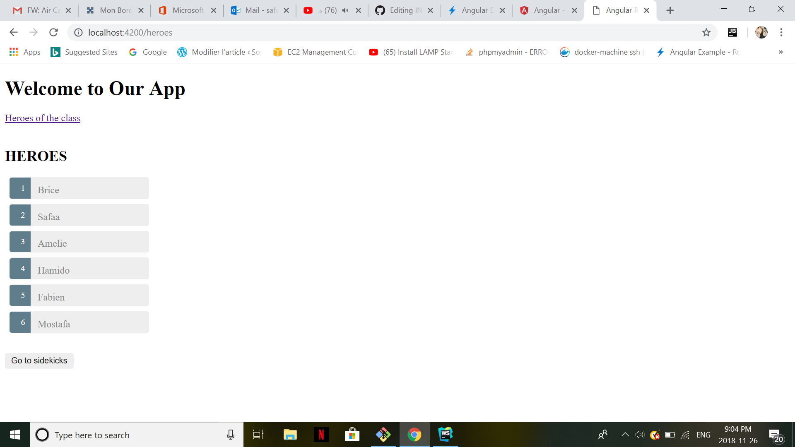

# Introduction :information_desk_person: :

Comme vous savez Angular vous aide à créer des applications modernes pour le Web dans votre mobile ou votre Laptop. Donc en general on l'utilise pour developper les sites Web

:arrow_right: Avant de commencer avec Anguler CLI on a besoin de :

Node.js (v8 ou 10) et npm package manager 

## Pourquoi on utilise Angular CLI ?

Il est utilisé pour créer des projets, générer des applications et publier du code.
et installez-le avec cette commande:

```
$ ng new b300XXXXX --style=css --routing=true && cd $_
```
Donc, vous devez créer votre projet où vous voulez développer votre application ou votre site Web, que faire:

:maple_leaf: La commande ng serve lance le serveur, surveille vos fichiers et reconstruit l'application
Avant de lancer votre site vous devez etre dans ton projet qui est "b300XXXX"

```
$ cd b300....
$ ng serve
```

Ouvrez votre navigateur sur http://localhost:4200/

Votre application vous accueille avec un message:



Notre menu d'aujourdhui c'est Heroes :



On Commence !

```
$ng generate component heroes/hero-list
$ng generate component heroes/hero-detail
```
Vous ouvrez votre projet avec ``` webStorm``` et vous devez changer le code en suivant ces parties:

:one:

#### src/index.html

```
<!DOCTYPE html>
<html lang="en">
<head>
  <!-- Set the base href -->
  <base href="/">
  <title>Welcome to our App</title>
  <meta charset="UTF-8">
  <meta name="viewport" content="width=device-width, initial-scale=1">
</head>

<body>
<app-root></app-root>
</body>

</html>
```
:point_right: Avant que nous continuons le reste du code, vous devez creer des fichiers ```ts``` dans ```app``` :

##### src/app/service.message.ts

```
import { Injectable } from '@angular/core';

@Injectable({
  providedIn: 'root',
})
export class MessageService {
  messages: string[] = [];

  add(message: string) {
    this.messages.push(message);
  }

  clear() {
    this.messages = [];
  }
}
```
#### src/app/selective-preloading-strategy.ts

```
import { Injectable } from '@angular/core';
import { PreloadingStrategy, Route } from '@angular/router';
import { Observable, of } from 'rxjs';

@Injectable({
  providedIn: 'root',
})
export class SelectivePreloadingStrategyService implements PreloadingStrategy {
  preloadedModules: string[] = [];

  preload(route: Route, load: () => Observable<any>): Observable<any> {
    if (route.data && route.data['preload']) {
      // add the route path to the preloaded module array
      this.preloadedModules.push(route.path);

      // log the route path to the console
      console.log('Preloaded: ' + route.path);

      return load();
    } else {
      return of(null);
    }
  }
}

```
##### src/app/animation.ts

```
import {
  trigger, animateChild, group,
  transition, animate, style, query
} from '@angular/animations';


// Routable animations
export const slideInAnimation =
  trigger('routeAnimation', [
    transition('heroes <=> hero', [
      style({ position: 'relative' }),
      query(':enter, :leave', [
        style({
          position: 'absolute',
          top: 0,
          left: 0,
          width: '100%'
        })
      ]),
      query(':enter', [
        style({ left: '-100%'})
      ]),
      query(':leave', animateChild()),
      group([
        query(':leave', [
          animate('300ms ease-out', style({ left: '100%'}))
        ]),
        query(':enter', [
          animate('300ms ease-out', style({ left: '0%'}))
        ])
      ]),
      query(':enter', animateChild()),
    ])
  ]);

```

## :two: Refactoriser la configuration de routage dans un module de routage:

```
$ ng generate module app-routing --module app --flat
```

:arrow_right: Après ces étapes, les fichiers devrait ressembler à ceci.

##### src/app/app-routing.module.ts

```
import { NgModule } from '@angular/core';
import { RouterModule, Routes } from '@angular/router';


const appRoutes: Routes = [
  { path: '',   redirectTo: '/heroes', pathMatch: 'full' },
];

@NgModule({
  imports: [
    RouterModule.forRoot(
      appRoutes,
      { enableTracing: true } // <-- debugging purposes only
    )
  ],
  exports: [
    RouterModule
  ]
})
export class AppRoutingModule {}

```

##### src/app/app.module.ts

```
import { NgModule } from '@angular/core';
import { BrowserModule } from '@angular/platform-browser';
import { FormsModule } from '@angular/forms';

import { AppComponent } from './app.component';
import { AppRoutingModule } from './app-routing.module';
import { HeroesModule } from './heroes/heroes.module';
import {BrowserAnimationsModule} from '@angular/platform-browser/animations';

@NgModule({
  imports: [
    BrowserModule,
    BrowserAnimationsModule,
    FormsModule,
    HeroesModule,
    AppRoutingModule
  ],
  declarations: [
    AppComponent
  ],
  bootstrap: [ AppComponent ]
})
export class AppModule { }
```
##### src/app/app.component.ts

```
import { Component } from '@angular/core';
import { RouterOutlet } from '@angular/router';
import { slideInAnimation } from './animations';

@Component({
  selector: 'app-root',
  templateUrl: 'app.component.html',
  styleUrls: ['app.component.css'],
  animations: [ slideInAnimation ]
})
export class AppComponent {
  getAnimationData(outlet: RouterOutlet) {
    return outlet && outlet.activatedRouteData && outlet.activatedRouteData['animation'];
  }
}

```
#### src/app/app.component.html

```
<h1 class="title">Welcome to Our App</h1>
<a routerLink="/superheroes" routerLinkActive="active">Heroes of the class</a>
<br>
<br>
<div [@routeAnimation]="getAnimationData(routerOutlet)">
  <router-outlet #routerOutlet="outlet"></router-outlet>
</div>
<router-outlet></router-outlet>

```

# :three: Configuration de menu Heroes :

Créez un HeroesModule avec un routage dans le dossier heroes et enregistrez-le avec la racine AppModule. C'est là que vous allez mettre en place la gestion des héros.

```
$ ng generate module heroes/heroes --module app --flat --routing
```
:exclamation: Assurez-vous que les fichiers suivants sont les memes commes suivant :exclamation:  :

#### src/app/heroes/heroes.module.ts 

```
import { NgModule } from '@angular/core';
import { CommonModule } from '@angular/common';
import { FormsModule } from '@angular/forms';

import { HeroListComponent } from './hero-list/hero-list.component';
import { HeroDetailComponent } from './hero-detail/hero-detail.component';

import { HeroesRoutingModule } from './heroes-routing.module';

@NgModule({
  imports: [
    CommonModule,
    FormsModule,
    HeroesRoutingModule
  ],
  declarations: [
    HeroListComponent,
    HeroDetailComponent
  ]
})
export class HeroesModule {}
```

#### src/app/heroes/heroes-routing.module.ts

```
import { NgModule } from '@angular/core';
import { RouterModule, Routes } from '@angular/router';

import { HeroListComponent } from './hero-list/hero-list.component';
import { HeroDetailComponent } from './hero-detail/hero-detail.component';

const heroesRoutes: Routes = [
  { path: 'heroes',  component: HeroListComponent },
  { path: 'hero/:id', component: HeroDetailComponent }
];

@NgModule({
  imports: [
    RouterModule.forChild(heroesRoutes)
  ],
  exports: [
    RouterModule
  ]
})
export class HeroesRoutingModule { }
```
:point_right: Avant de continuer la configuration des autres fichiers, vous devez creer des fichiers ```ts``` dans ```heroes``` :exclamation: :

#### src/app/heroes/hero.ts

```
export class Hero {
  id: number;
  name: string;
}
```

#### src/app/heroes/hero.service.ts

```
import { Injectable } from '@angular/core';

import { Observable, of } from 'rxjs';
import { map } from 'rxjs/operators';

import { Hero } from './hero';
import { HEROES } from './mock-heroes';
import { MessageService } from '../message.service';

@Injectable({
  providedIn: 'root',
})
export class HeroService {

  constructor(private messageService: MessageService) { }

  getHeroes(): Observable<Hero[]> {
    // TODO: send the message _after_ fetching the heroes
    this.messageService.add('HeroService: fetched heroes');
    return of(HEROES);
  }

  getHero(id: number | string) {
    return this.getHeroes().pipe(
      // (+) before `id` turns the string into a number
      map((heroes: Hero[]) => heroes.find(hero => hero.id === +id))
    );
  }
}
```

#### src/app/heroes/mock-heroes.ts

```
import { Hero } from './hero';

export const HEROES: Hero[] = [
  { id: 1, name: 'Brice' },
  { id: 2, name: 'Safaa' },
  { id: 3, name: 'Amelie' },
  { id: 4, name: 'Hamido' },
  { id: 5, name: 'Fabien' },
  { id: 6, name: 'Mostafa' }

];

```
:arrow_right: Maintenant on doit changer les fichiers de` Heroes/hero-list `et ` Heroes/hero-detail `, donc il faut juste s'assurer d'avoir le code suivant :

## :one: hero-detail :

#### src/app/heroes/hero-detail/hero-detail.component.ts
```
import { Component, OnInit } from '@angular/core';
import { Router, ActivatedRoute, ParamMap } from '@angular/router';
import { switchMap } from 'rxjs/operators';
import {HeroService} from '../hero.service';
import {Hero} from '../hero';
import {Observable} from 'rxjs';

@Component({
  selector: 'app-hero-detail',
  templateUrl: './hero-detail.component.html',
  styleUrls: ['./hero-detail.component.css']
})
export class HeroDetailComponent implements OnInit {
  private hero$: Observable<Hero>;

  constructor(
    private route: ActivatedRoute,
    private router: Router,
    private service: HeroService
  ) {}
  gotoHeroes(hero: Hero) {
    let heroId = hero ? hero.id : null;
    // Pass along the hero id if available
    // so that the HeroList component can select that hero.
    // Include a junk 'foo' property for fun.
    this.router.navigate(['/heroes', { id: heroId, foo: 'foo' }]);
  }
  ngOnInit() {
    let id = this.route.snapshot.paramMap.get('id');

    this.hero$ = this.service.getHero(id);
  }

}

```

#### src/app/heroes/hero-detail/hero-detail.component.html

```
<h2>HEROES</h2>
<div *ngIf="hero$ | async as hero">
  <h3>"{{ hero.name }}"</h3>
  <div>
    <label>Id: </label>{{ hero.id }}</div>
  <div>
    <label>Name: </label>
    <input [(ngModel)]="hero.name" placeholder="name"/>
  </div>
  <p>
    <button (click)="gotoHeroes(hero)">Back</button>
  </p>
</div>

```

## :two: hero-list :

#### src/app/heroes/hero-list/hero-list.component.ts

```
import { Observable } from 'rxjs';
import { switchMap } from 'rxjs/operators';
import { Component, OnInit } from '@angular/core';
import { ActivatedRoute } from '@angular/router';

import { HeroService } from '../hero.service';
import { Hero } from '../hero';

@Component({
  selector: 'app-hero-list',
  templateUrl: './hero-list.component.html',
  styleUrls: ['./hero-list.component.css']
})
export class HeroListComponent implements OnInit {
  heroes$: Observable<Hero[]>;
  selectedId: number;

  constructor(
    private service: HeroService,
    private route: ActivatedRoute
  ) {}

  ngOnInit() {
    this.heroes$ = this.route.paramMap.pipe(
      switchMap(params => {
        // (+) before `params.get()` turns the string into a number
        this.selectedId = +params.get('id');
        return this.service.getHeroes();
      })
    );
  }
}
```
#### src/app/heroes/hero-list/hero-list.component.html

```
<h2>HEROES</h2>
<ul class="heroes">
  <li *ngFor="let hero of heroes$ | async"
      [class.selected]="hero.id === selectedId">
    <a [routerLink]="['/hero', hero.id]">
      <span class="badge">{{ hero.id }}</span>{{ hero.name }}
    </a>
  </li>
</ul>

<button routerLink="/sidekicks">Go to sidekicks</button>

```
#### src/app/heroes/hero-list/hero-list.component.css

```

.heroes {
  margin: 0 0 2em 0;
  list-style-type: none;
  padding: 0;
  width: 15em;
}
.heroes li {
  position: relative;
  cursor: pointer;
  background-color: #EEE;
  margin: .5em;
  padding: .3em 0;
  height: 1.6em;
  border-radius: 4px;
}

.heroes li:hover {
  color: #607D8B;
  background-color: #DDD;
  left: .1em;
}

.heroes a {
  color: #888;
  text-decoration: none;
  position: relative;
  display: block;
}

.heroes a:hover {
  color:#607D8B;
}

.heroes .badge {
  display: inline-block;
  font-size: small;
  color: white;
  padding: 0.8em 0.7em 0 0.7em;
  background-color: #607D8B;
  line-height: 1em;
  position: relative;
  left: -1px;
  top: -4px;
  height: 1.8em;
  min-width: 16px;
  text-align: right;
  margin-right: .8em;
  border-radius: 4px 0 0 4px;
}

button {
  background-color: #eee;
  border: none;
  padding: 5px 10px;
  border-radius: 4px;
  cursor: pointer;
  cursor: hand;
  font-family: Arial;
}

button:hover {
  background-color: #cfd8dc;
}

button.delete {
  position: relative;
  left: 194px;
  top: -32px;
  background-color: gray !important;
  color: white;
}

.heroes li.selected {
  background-color: #CFD8DC;
  color: white;
}
.heroes li.selected:hover {
  background-color: #BBD8DC;
}

```
:star2: Et voila, vous devez simplement parcourir localhost: 4200 et vous devez avoir le résultat final :star2:
