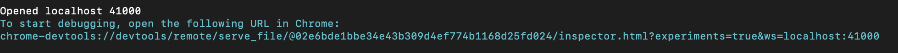

# NativeScript


## Installer NativeScript CLI

```
$ npm install --global nativescript@latest
```

## Tester l'installation

```
$ tns --version
5.0.0
```

## Installer  

 NativeScript Playground app   :mahjong:
 
* Remplacer votre `<ID>` par votre propre :id:
 
* Remplacer `<template>` par :
 
 - angular
 
 - tns-template-drawer-navigation-ng

 - tns-template-tab-navigation-ng


 
```
$ tns create b<ID> --template <template>
```

## Debug (Console)

https://stackoverflow.com/questions/45397523/how-to-debug-nativescript-app-in-chrome-browser-and-view-output-in-chrome

```
$ tns debug -ios chrome
```

* Reperer l'URL dans la sortie d'ecran et la copier dans chrome




# References: 

https://docs.nativescript.org/app-and-screen-templates/app-templates
